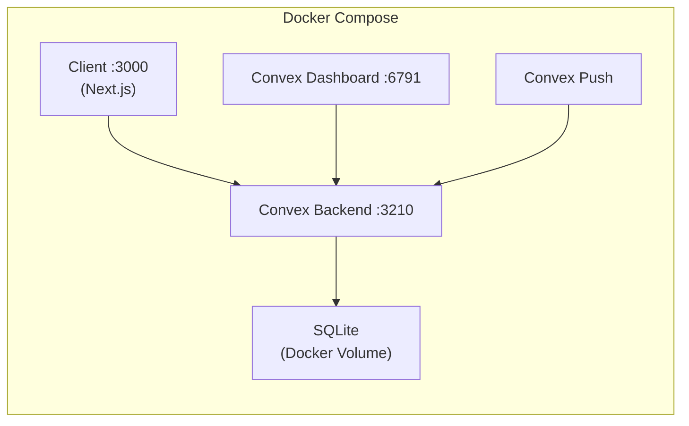

# nextjs-convex-docker

[](https://nextjs.org/) [](https://convex.dev/) [](https://docker.com/)

A reusable development template with **Next.js**, **self-hosted Convex backend**, and **Convex dashboard**, fully orchestrated via Docker Compose.

## Architecture



## Prerequisites

| Tool | Version |
|------|---------|
| [Node.js](https://nodejs.org/) | 20+ |
| [npm](https://www.npmjs.com/) | 10+ |
| [Docker](https://docs.docker.com/get-docker/) | 24+ |
| [Docker Compose](https://docs.docker.com/compose/) | V2 (plugin) |

## Quick Start

### 1. Scaffold the project

```bash
chmod +x setup.sh
./setup.sh --init client
```

This will:
- Create a **Next.js** app in `client/` (TypeScript, Tailwind, App Router)
- Install `convex@latest` in the client
- Copy `docker/client.env.local` → `client/.env.local` and `docker/client.Dockerfile` → `client/Dockerfile.dev`

### 2. Start the dev environment

```bash
./setup.sh --dev docker up
```

This will automatically:
1. Start the backend, dashboard, and client containers
2. Wait for the backend to be healthy
3. Generate the admin key and save it to `.convex_admin_key`
4. Deploy your `convex/` functions via the **convex-push** container

| Service | URL | Description |
|---------|-----|-------------|
| **Backend** | http://localhost:3210 | Convex self-hosted backend |
| **HTTP Actions** | http://localhost:3211 | Convex HTTP action endpoints |
| **Dashboard** | http://localhost:6791 | Convex web dashboard |
| **Client** | http://localhost:3000 | Next.js dev server (hot-reload) |
| **Convex Push** | - | Deploys `convex/` functions to backend |

Use the admin key (printed in output) to log into the **Dashboard** at http://localhost:6791.

### 3. Stop the dev environment

```bash
# Stop containers (preserves volumes & data)
./setup.sh --dev docker down

# Remove containers AND volumes (full reset)
./setup.sh --dev docker cleanup
```

## Command Reference

```
./setup.sh --init client          # Scaffold the project (first-time setup)
./setup.sh --reset client         # Remove & re-scaffold client
./setup.sh --remove client        # Remove client (no re-scaffold)
./setup.sh --dev docker up         # Start dev Docker environment
./setup.sh --dev docker down       # Stop containers (keeps volumes)
./setup.sh --dev docker cleanup    # Remove containers and volumes
./setup.sh --generate-admin-key    # Generate & save Convex admin key
./setup.sh --help                  # Show help
```

## Project Structure

```
.
├── setup.sh                 # Main entry-point script
├── .gitignore
├── .convex_admin_key        # Generated - admin key (git-ignored)
├── docker/
│   ├── docker-compose.yml   # 3 services: backend, dashboard, client
│   ├── client.Dockerfile    # Dev container for Next.js
│   └── client.env.local     # Template .env.local for client
└── client/                  # Created by ./setup.sh
    ├── Dockerfile.dev       # Copied from docker/client.Dockerfile
    ├── .env.local           # Copied from docker/client.env.local
    ├── convex/              # Your Convex functions go here
    │   └── convex.config.ts
    ├── src/
    │   └── app/             # Next.js App Router pages
    ├── package.json
    └── ...
```

## Environment Variables

### Client (`client/.env.local`)

| Variable | Default | Description |
|----------|---------|-------------|
| `CONVEX_SELF_HOSTED_URL` | `http://backend:3210` | Backend URL (Docker internal) |
| `CONVEX_SELF_HOSTED_ADMIN_KEY` | *(generated)* | Admin key for CLI & dashboard |

> **Note:** When running `npx convex dev` **outside** Docker, change the URL to `http://127.0.0.1:3210`.

### Docker Compose (optional overrides)

Set these in a `.env` file at the project root or export them before running:

| Variable | Default | Description |
|----------|---------|-------------|
| `PORT` | `3210` | Backend port |
| `SITE_PROXY_PORT` | `3211` | HTTP actions port |
| `DASHBOARD_PORT` | `6791` | Dashboard port |
| `CLIENT_PORT` | `3000` | Next.js dev port |
| `POSTGRES_URL` | *(none)* | Use Postgres instead of SQLite |
| `MYSQL_URL` | *(none)* | Use MySQL instead of SQLite |
| `DISABLE_BEACON` | *(none)* | Set to disable telemetry beacon |

## Documentation

| Resource | Link |
|----------|------|
| **Next.js** | [nextjs.org/docs](https://nextjs.org/docs) |
| **Convex** | [docs.convex.dev](https://docs.convex.dev) |
| **Convex Self-Hosting** | [Self-hosting guide](https://github.com/get-convex/convex-backend/blob/main/self-hosted/README.md) |
| **Docker Compose** | [docs.docker.com/compose](https://docs.docker.com/compose) |

## Production Considerations

- **Database:** Switch from SQLite to PostgreSQL/MySQL by setting `POSTGRES_URL` or `MYSQL_URL` - see the [Postgres or MySQL guide](https://github.com/get-convex/convex-backend/blob/main/self-hosted/advanced/postgres_or_mysql.md)
- **Persistent storage:** Configure Docker volumes or cloud storage (AWS EBS) for the `convex_data` volume
- **S3 storage:** Configure S3 buckets for exports, files, modules, and search indexes via environment variables
- **Frontend hosting:** Deploy the client to Vercel/Netlify using `CONVEX_SELF_HOSTED_URL` and `CONVEX_SELF_HOSTED_ADMIN_KEY` as env vars
- **Pin versions:** Change `latest` to a specific tag in `docker/docker-compose.yml` for reproducible builds

## Troubleshooting

| Issue | Solution |
|-------|----------|
| Backend not starting | Check `docker compose logs backend` for errors |
| Admin key generation fails | Ensure backend is healthy: `docker compose ps` |
| Client can't reach backend | Inside Docker, use `http://backend:3210`. Outside Docker, use `http://127.0.0.1:3210` |
| Hot-reload not working | Ensure `WATCHPACK_POLLING=true` is set (already configured in docker-compose) |
| Dashboard won't load | Wait for backend health check to pass, then refresh |

## License

MIT
